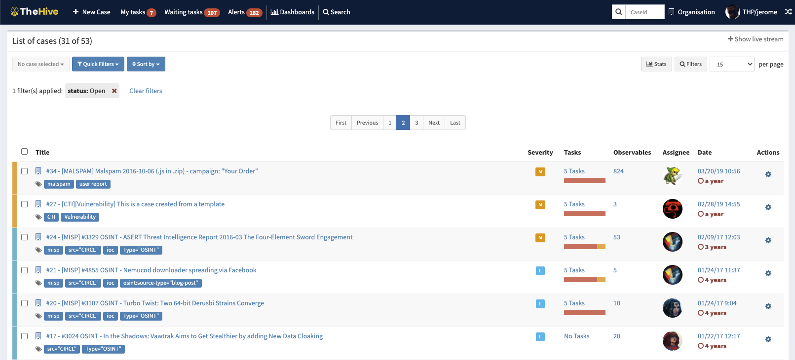
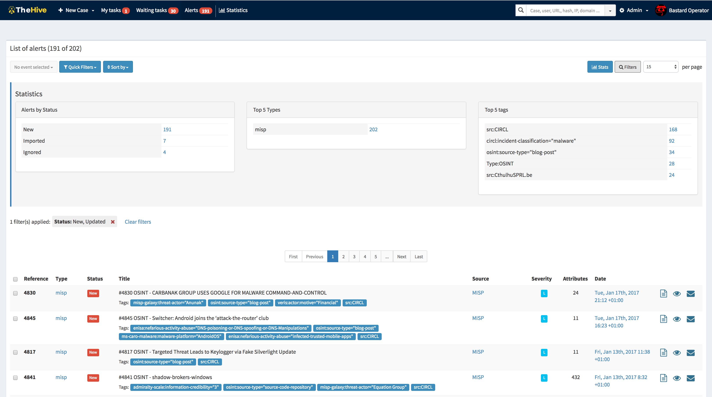

[TheHive](https://thehive-project.org/) is a scalable 3-in-1 open source and free security incident response platform designed to make life easier for SOCs, CSIRTs, CERTs and any information security practitioner dealing with security incidents that need to be investigated and acted upon swiftly.

## Collaborate
Collaboration is at the heart of TheHive. Multiple analysts can work on the same case simultaneously. For example, an analyst may deal with malware analysis while another may work on tracking C2 beaconing activity on proxy logs as soon as IOCs have been added by their coworker. Using TheHive's live stream, everyone can keep an eye on what's happening on the platform, in real time.

## Elaborate
Within TheHive, every investigation corresponds to a case. Cases can be created from scratch or from [MISP](http://www.misp-project.org/) events, SIEM alerts, email reports and any other noteworthy source of security events.

Each case can be broken down into one or more tasks. Instead of adding the same tasks to a given type of case every time one is created, analysts can use TheHive's template engine to create them once and for all. Case templates can also be used to associate metrics to specific case types in order to drive the team's activity, identify the type of investigations that take significant time and seek to automate tedious tasks.

Each task can be assigned to a given analyst. Team members can also take charge of a task without waiting for someone to assign it to them.

Tasks may contain multiple work logs that contributing analysts can use to describe what they are up to, what was the outcome, attach pieces of evidence or noteworthy files and so on. Logs can be written using a rich text editor or Markdown.

## Analyze
You can add one or hundreds if not thousands of observables to each case you create. You can also create a case out of a [MISP](http://www.misp-project.org/) event. TheHive can be very easily linked to one or several MISP instances and MISP events can be previewed to decide whether they warrant an investigation or not. If an investigation is in order, the analyst can then import the event into a case using a customizable template.

Thanks to [TheHive4py](https://thehive-project.org/#section_thehive4py), TheHive's Python API client, it is possible to send SIEM alerts, phishing and other suspicious emails and other security events to TheHive. They will appear in its `Alerts` panel along with new or updated MISP events, where they can be previewed, imported into cases or ignored.

TheHive has the ability to automatically identify observables that have been already seen in previous cases. Observables can also be associated with a TLP and the source which provided or generated them using tags. The analyst can also easily mark observables as IOCs and isolate those using a search query then export them for searching in a SIEM or other data stores.

Starting from Buckfast (TheHive version 2.10), analysts can analyze tens or hundreds of observables in a few clicks by leveraging the analyzers of one or several [Cortex](https://github.com/CERT-BDF/Cortex/) instances depending on your OPSEC needs: DomainTools, VirusTotal, PassiveTotal, Joe Sandbox, geolocation, threat feed lookups and so on. Before Buckfast, the analysis engine which gave birth to Cortex was embedded in TheHive's back-end code.

Security analysts with a knack for scripting can easily add their own analyzers to Cortex in order to automate actions that must be performed on observables or IOCs. They can also decide how analyzers behave according to the TLP. For example, a file added as observable can be submitted to VirusTotal if the associated TLP is WHITE or GREEN. If it's AMBER, its hash is computed and submitted to VT but not the file. If it's RED, no VT lookup is done.

# Try it
To use TheHive, you can:
- Install the [RPM package](docs/installation/rpm-guide.md)
- Install the [DEB package](docs/installation/deb-guide.md)
- Use [docker](docs/installation/docker-guide.md)
- Use the [binary](docs/installation/binary-guide.md)
- Execute the [Ansible script](https://github.com/drewstinnett/ansible-thehive) contributed by
[@drewstinnett](https://github.com/drewstinnett)
- [Build it from sources](docs/installation/build-guide.md) then run it

# Details
## Architecture
TheHive is written in Scala and uses ElasticSearch 2.x for storage. Its REST API is stateless which allows it to be horizontally scalable. The front-end uses AngularJS with Bootstrap.

## Workflow
The following image shows a typical workflow:

## Additional features
### Authentication
TheHive supports 3 authentication methods:
+ Active Directory
+ LDAP
+ local

### Statistics
TheHive comes with a powerful statistics module that allows you to create meaningful dashboards to drive your activity and support your budget requests.

### Case Merging
Two cases can be easily merged together if you believe that they relate to the same threat or have a significant observable overlap.

### Case and Observable Filtering
You can filter cases and observables very easily to show only the data that is of interest to you.

### MISP and Cortex
TheHive can be configured to import events from one or multiple [MISP](http://www.misp-project.org/) instances. It can also analyze observables using one or several [Cortex](https://github.com/CERT-BDF/Cortex/) servers.

# License
TheHive is an open source and free software released under the [AGPL](https://github.com/CERT-BDF/TheHive/blob/master/LICENSE) (Affero General Public License). We, TheHive Project, are committed to ensure that TheHive will remain a free and open source project on the long-run.

# Updates
Information, news and updates are regularly posted on [TheHive Project Twitter account](https://twitter.com/thehive_project) and on [the blog](https://blog.thehive-project.org/).

# Contributing
We welcome your contributions. Please feel free to fork the code, play with it, make some patches and send us pull requests.

# Support
Please [open an issue on GitHub](https://github.com/CERT-BDF/TheHive/issues) if you'd like to report a bug or request a feature. We are also available on [Gitter](https://gitter.im/TheHive-Project/TheHive) to help you out.

If you need to contact the project team, send an email to <support@thehive-project.org>.

**Important Note**:

- If you have problems with [TheHive4py](https://github.com/CERT-BDF/TheHive4py), please [open an issue on its dedicated repository](https://github.com/CERT-BDF/TheHive4py/issues/new).
- If you encounter an issue with Cortex or would like to request a Cortex-related feature, please [open an issue on its dedicated GitHub repository](https://github.com/CERT-BDF/Cortex/issues/new).
- If you have troubles with a Cortex analyzer or would like to request a new one or an improvement to an existing analyzer, please open an issue on the [analyzers' dedicated GitHub repository](https://github.com/CERT-BDF/cortex-analyzers/issues/new).

# Community Discussions
We have set up a Google forum at <https://groups.google.com/a/thehive-project.org/d/forum/users>. To request access, you need a Google account. You may create one [using a Gmail address](https://accounts.google.com/SignUp?hl=en) or [without it](https://accounts.google.com/SignUpWithoutGmail?hl=en).

# Website
<https://thehive-project.org/>
